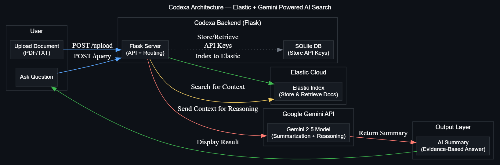

# Codexa – Evidence-Powered AI for Smarter Search

Codexa is an intelligent document understanding assistant that combines **Elastic Search** and **Google Gemini** to help teams find factual answers with confidence and clarity.

Upload any document (PDF or text), ask natural questions, and Codexa will search, reason, and summarize verified answers with clear evidence — all in seconds.

---

## Features

- **Evidence-Based AI**  
  Every answer references the original source material for full transparency.
- **Elastic + Gemini Integration**  
  Elastic provides the fast, accurate retrieval layer. Gemini refines it into concise, contextual answers.
- **API Access**  
  Use Codexa through its dashboard or directly via REST API endpoints.
- **Lightweight Architecture**  
  Powered by Flask, Elastic Cloud, and Gemini 2.5, designed for quick deployment and testing.

---

## System Architecture

Codexa’s workflow:

1. Users upload PDFs or text files.
2. Documents are indexed into Elastic Cloud for search.
3. When a question is asked, Codexa retrieves context from Elastic.
4. The relevant context is sent to Google Gemini for reasoning and summarization.
5. The combined answer and supporting evidence are returned instantly.



---

## ⚙️ Setup & Installation

### 1. Clone the repository

```bash
git clone https://github.com/yourusername/codexa.git
cd codexa
```

### 2. Create a virtual environment

```bash
python -m venv venv
venv\Scripts\activate   # On Windows
source venv/bin/activate  # On macOS/Linux
```

### 3. Install dependencies

```bash
pip install -r requirements.txt
```

### 4. Configure environment variables

Create a .env file in the root directory:

```bash
# Elastic configuration
ELASTIC_URL=https://your-elastic-endpoint
ELASTIC_API_KEY=your_elastic_api_key_here

# Gemini configuration
GEMINI_API_KEY=your_gemini_api_key_here
GEMINI_MODEL=models/gemini-2.5-flash

# Optional admin token (for project management routes)
# You can choose any value, just keep it consistent between backend and frontend
ADMIN_TOKEN=my_secret_token_123
```

---

## Admin Token Setup 🔑

Codexa uses a lightweight admin token system to control access to project creation and management endpoints.

- In your .env, set:

```bash
ADMIN_TOKEN=my_secret_token_123
```

- In dashboard.html and api_keys.html, replace the placeholder:

```bash
const ADMIN_TOKEN = "my_secret_token_123";
```

This allows you to load and manage project API keys through the dashboard.
It’s a simple protection layer used only for the prototype (full authentication will be added later).

---

## Running Locally

Start the Flask server

```bash
python app.py
```

Then open your browser at:
http://127.0.0.1:5000

You’ll see the Codexa dashboard where you can:

- Upload documents
- Ask questions
- View the AI’s evidence-backed answers

---

## Project Structure 🗂️

Codexa/
│ app.py # Main Flask app
│ db.py # Handles project & API key storage
│ codexa.db # SQLite database
│ requirements.txt # Dependencies
│ README.md
│ .env
│
├───static/
│ ├───css/
│ │ style.css
│ ├───img/
│ │ codexa-logo.png
│ │ codexa-architecture.png
│ │ favicon.ico
│ └───js/
│ main.js # (Currently unused placeholder)
│
├───templates/
│ index.html # Landing page
│ dashboard.html # Upload & query interface
│ api_keys.html # API key management
│ privacy.html # Privacy notice
│
├───uploads/
│ .gitkeep # Empty folder for temporary uploads
│
└───**pycache**/

---

## Usage Example 📘

Upload and query through API:

```bash
# Upload a document
curl -X POST http://127.0.0.1:5000/api/upload \
  -H "X-API-Key: <your_api_key>" \
  -F "file=@elastic_trust_faq.pdf"

# Ask a question
curl -X POST http://127.0.0.1:5000/api/query \
  -H "Content-Type: application/json" \
  -H "X-API-Key: <your_api_key>" \
  -d '{"query": "Which certifications does Elastic Cloud follow?"}'
```

---

## ⚠️ Prototype Notice

This version of Codexa was developed as a working prototype for the
AI Accelerate: Unlocking New Frontiers Hackathon

(hosted by Google Cloud, Elastic & Fivetran).

Please do not upload any sensitive or private data — this environment does not yet include user authentication or data isolation.
Future releases will include secure project-level access and private storage.

---

## Prompt Design (for Codexa AI)

Codexa’s reasoning behavior is guided by this internal prompt (you can include it or replace it with an image in your docs):

```bash
You are Codexa, an intelligent document understanding assistant.

Your task:
- Provide a direct, confident answer first, based on the given context.
- Then explain briefly with key facts or reasoning.
- Mention relevant evidence only if it strengthens the answer.
- If the document does not contain the answer, say: "That detail isn’t covered in the provided document."

Style:
- Write in clear, natural English — no robotic phrasing.
- Avoid unnecessary disclaimers like “based on the provided text”.
- Keep the tone professional, short, and easy to read.
```

---

## Tech Stack

- Backend: Flask (Python)
- Search Engine: Elastic Cloud
- AI Reasoning: Google Gemini 2.5 Flash
- Database: SQLite
- Frontend: HTML, CSS, JS
- Deployment: Gunicorn (for production)

---

## 🧾 License

This project is released under the MIT License.
© 2025 Codexa — Powered by Elastic & Gemini.
